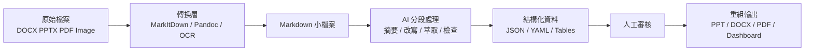
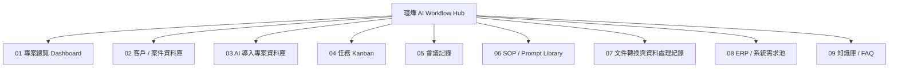
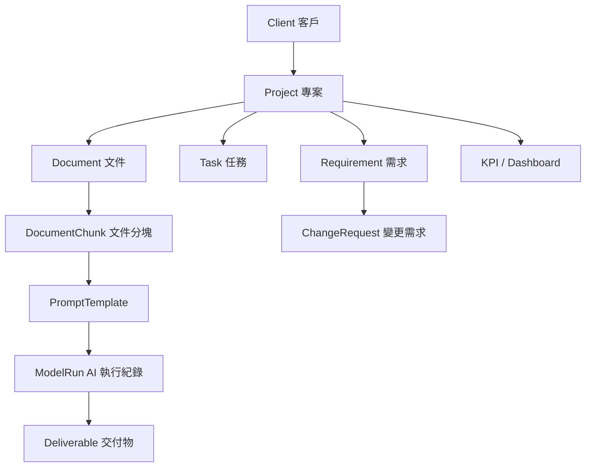

# 企業 AI Workflow 基礎建設與文件協同轉型工作坊

> 人類審閱與教課備忘主檔  
> Source: `workshops/source/notion-spec.md` + `workshops/source/notion-master.md`  
> 用途：快速確認每頁在講什麼、怎麼講、畫面放什麼、後續要補哪些素材。

## 封面摘要

| 項目 | 內容 |
| --- | --- |
| Workshop 名稱 | 企業 AI Workflow 基礎建設與文件協同轉型工作坊 |
| 受眾 | 瑄燁團隊 10 人：3 技術、2 決策、5 商學背景 |
| 教學目標 | 建立可複製、可追蹤、可交付的企業 AI 作業方法 |
| 建議總時長 | 120 分鐘，可依互動與實操情況延伸 |
| 核心主張 | AI 不是直接吃最終文件，而是處理乾淨、結構化、可切分的中間資料。 |
| 教學節奏 | 概念 30% + 示範 40% + 實操 20% + Q&A 10% |

## 課程總節奏

| 章節 | 頁面 | 建議時間 | 教學目的 | 主要輸出物 |
| --- | --- | --- | --- | --- |
| 開場與共識 | P1-P4 | 0:00-10:00 | 建立 AI Workflow 不是聊天工具的共同認知 | 共同問題、工具使用調查、三大特徵 |
| 文件工程與格式策略 | P5-P12 | 10:00-36:00 | 說明為何 DOCX/PPTX 不適合作為 AI 中間格式 | 格式矩陣、文件流程、轉檔示範規格 |
| 模型選型與成本控制 | P13-P18 | 36:00-58:00 | 讓團隊理解模型分工與 token 成本控制 | 模型矩陣、成本壞習慣、改善口訣 |
| Notion 線上化與瑄燁架構 | P19-P24 | 58:00-80:00 | 把專案資訊從檔案夾升級成可查詢作業系統 | Notion DB 架構、Relation/Rollup 示範 |
| Obsidian / LLM-WIKI / Context | P25-P29 | 80:00-98:00 | 建立本地知識庫、LLM 友善 repo 與上下文工程概念 | Vault 結構、LLM-WIKI 目錄、Context 流程 |
| AI 工程概念與 ERP 路線 | P30-P33 | 98:00-112:00 | 建立 RAG、Harness、Agentic 與 ERP/AI SOP 發展順序 | 三層金字塔、ERP 模組路線圖 |
| 實操與收束 | P34-P35 | 112:00-120:00 | 現場練習、Q&A、三大結論與後續服務 | 任務卡、30/60/90 行動清單、QR |

## 頁面素材放置索引

> 這張表給審稿與後續製作使用：先決定每頁圖片、圖表、影片或 QR 應該放在哪裡，再進入 HTML deck 實作。

| 頁面 | 主要素材類型 | 建議放置位置 | 照片 / 圖表簡述 | 備註 |
| --- | --- | --- | --- | --- |
| P1 | 圖片 | 右下角或右側 35% 區域 | 講者或企業 workshop 主視覺，保留左側大標題呼吸空間 | 若沒有講者照，先用企業訓練情境圖 |
| P2 | 資訊圖表 | 左側時間軸、右側比例圖 | 120 分鐘節奏與 30/40/20/10 比例 | 不需要照片 |
| P3 | 對比圖 | 左右雙欄 | 左：個人 AI 使用；右：企業 AI Workflow | 可搭配便利貼互動 |
| P4 | 問題牆 | 全頁或右側 45% | Email、Word、PPT、截圖、LINE、人工版本命名的混亂來源 | 用圖像化問題牆，不用真實敏感資料 |
| P5 | 對比截圖 | 左右雙欄 | DOCX raw XML vs Markdown 純文字 | 需準備 VS Code 截圖 |
| P6 | 資訊表 | 全頁表格 | 8 種格式 × 輸入/中間/交付 | 表格用 `.editorial` 樣式 |
| P7 | Mermaid / diagram | 中央 full-bleed | 原始檔案到重組輸出的文件 AI 化流程 | 後續轉互動 pipeline |
| P8 | 程式碼樹 | 右側或全頁 code frame | `input/ process/ output/` 工作資料夾 | 不需要照片 |
| P9 | 工具矩陣 | 全頁表格 | MarkItDown、Pandoc、OCR、Obsidian、NotebookLM 分工 | 可搭配小型工具 icon |
| P10 | 三步驟圖 | 左到右三欄 | 掃描文件 → OCR → Markdown/CSV 結構化 | 可補 OCR 錄影 |
| P11 | 四象限 | 2x2 grid | Markdown、JSON、CSV、YAML 的角色分工 | 每格放一小段範例 |
| P12 | 三張大卡 | 全頁三欄 | 拆分、結構化、保存 | 章節收束頁 |
| P13 | 矩陣 + 散布圖 | 上表下圖或左右分欄 | 七大任務情境與模型成本/複雜度 | 可搭配成本對比短片 |
| P14 | 成本漏斗 | 中央大圖 | 原始上下文經拆分、OCR、模板化後只保留高價值推理 | 不需要照片 |
| P15 | Compare table | 左紅右綠 | Token 高消耗行為 vs 改善方式 | 可搭配 usage dashboard |
| P16 | 口訣海報 | 中央大字 | 大文件先拆、小任務先跑、圖片先 OCR | 適合投影強記憶點 |
| P17 | 任務卡 | 6 張卡片 grid | 模型選型現場練習 | 需要紙本任務卡 |
| P18 | 三角圖 | 中央 | 成本、品質、可重跑性 | 轉場到 Notion |
| P19 | 對比圖 / 截圖 | 左右雙欄 | 傳統資料散落 vs Notion Hub | 建議用真實 Notion demo 截圖 |
| P20 | 概念表 | 全頁表格 | Page、Database、Property、Relation、Rollup、Template、View | 教學程度欄位要清楚 |
| P21 | Mermaid / diagram | 中央 full-bleed | 瑄燁 AI Workflow Hub 九大資料庫 | 後續轉 hover 關聯網 |
| P22 | 資料表 | 兩欄表格 | Project Database + Task Database | 表格用 `.editorial` 樣式 |
| P23 | QR + 步驟 | QR 置中或右側，步驟在左 | Notion Demo Workspace 共編入口 | 需要權限備援截圖 |
| P24 | 工具定位表 | 全頁表格 | Notion、Obsidian、GitHub、NotebookLM、RAG 分工 | Notion 章節收束 |
| P25 | 對比圖 / 截圖 | 左右雙欄 | Notion 協作 vs Obsidian 本地 Vault | 需要 Obsidian Graph 截圖 |
| P26 | Code frame | 左目錄樹、右 YAML | Vault 架構與 frontmatter | 不需要照片 |
| P27 | Repo tree | 中央 code frame | LLM-WIKI GitHub-style 目錄 | 可補 GitHub 搜尋錄影 |
| P28 | 對比圖 | 左右雙欄 | 整份 PDF 丟給 AI vs 結構化 context pipeline | 可搭配品質對比短片 |
| P29 | 階梯圖 | 中央 | 資料格式 → 流程 → 權限 → 知識庫 → RAG/Harness/Agentic | 轉場到工程概念 |
| P30 | 金字塔 | 中央 | RAG / Harness / Agentic 三層 | 後續轉互動圖 |
| P31 | Pipeline | 左到右流程 | input → parser → prompt → model → validator → review → export | 可用合約審查範例 |
| P32 | Roadmap | 橫向時間軸 | L2 可視化 → L3 透明化 → L5 自適化 | ERP/AI SOP 主視覺 |
| P33 | Mermaid / data model | 中央 full-bleed | Client、Project、Task、Document、PromptTemplate、ModelRun、KPI | 後續轉資料關聯圖 |
| P34 | 任務卡 + 現場照 | 三張任務卡與背景情境圖 | 檔案結構、模型選型、Notion 頁設計 | 需要控時計時器 |
| P35 | 結論 + QR | 三欄結論，右下或中央 QR | 格式 → 協作 → 知識庫；30/60/90 天行動 | 結尾頁需保留聯絡資訊 |

## 逐頁內容包

### P1 封面

| 欄位 | 內容 |
| --- | --- |
| H1 | 企業 AI Workflow 基礎建設與文件協同轉型 |
| H2 | 從 Prompt 到 Workflow：讓 AI 真正落進企業作業流 |
| H3 | 瑄燁團隊工作坊 / 主講人 / 日期 |
| 這頁在講什麼 | 宣告這場課不是 ChatGPT 教學，而是建立企業可複製、可交付、可追蹤成本的 AI 作業方法。 |
| 講課備忘 | 開場要先降低工具炫技感，讓決策者知道這是流程與知識管理議題，讓技術人員知道後面會談工程路徑。 |
| 建議時間 | 0:00-0:30 |
| 畫面元素 | 大標題、工作坊副標、受眾標籤、講者/日期、右下角講師照或公司識別 placeholder。 |
| 配圖提示詞 | 生成一張企業 AI workflow workshop 主視覺：暖白紙張背景、細緻鈷藍格線、專業講者與團隊討論場景、低調顧問簡報氛圍、避免科幻感、繁中企業訓練語境。 |
| 資訊圖表 | 不需要，保持封面簡潔。 |
| 短影片 | 不需要。 |
| Mermaid / diagram | 不需要。 |

### P2 今日議程

| 欄位 | 內容 |
| --- | --- |
| H1 | 今日議程 |
| H2 | 120 分鐘節奏設計 |
| H3 | 講解 30% / 示範 40% / 實操 20% / Q&A 10% |
| 這頁在講什麼 | 說明整場由「為什麼」到「怎麼做」再到「未來方向」的節奏，中間穿插示範與實操。 |
| 講課備忘 | 這頁要順手做破冰調查：誰用 Notion、Obsidian、ChatGPT 付費版、公司目前是否有固定 AI SOP。 |
| 建議時間 | 0:30-2:00 |
| 畫面元素 | 左側時間軸，右側比例圓環或橫向比例條。 |
| 配圖提示詞 | 生成一張企業工作坊議程視覺：一張乾淨桌面上有筆電、便利貼、時間軸卡片，鈷藍細線與暖白紙張風格，專業但不制式。 |
| 資訊圖表 | 30/40/20/10 比例圖；8 段課程時間軸。 |
| 短影片 | 不需要。 |
| Mermaid / diagram | 不需要。 |

### P3 共識建立

| 欄位 | 內容 |
| --- | --- |
| H1 | 為什麼會用 AI，不代表企業真的有 AI Workflow？ |
| H2 | 個人使用 vs 組織作業系統 |
| H3 | 聊天工具假象 / 效率假象 / 創新假象 |
| 這頁在講什麼 | 把「會問 AI」和「有企業流程」分開。若 AI 產出無法讓下一個人接手，就只是 chat history。 |
| 講課備忘 | 問現場：「公司有沒有任何一份 AI 產出，是下一個人可以直接接手的？」等待 5 秒。 |
| 建議時間 | 2:00-6:00 |
| 畫面元素 | 左欄個人聊天工具，右欄企業 pipeline；中間放 `Reproducible / Traceable / Deliverable` 三個關鍵詞。 |
| 配圖提示詞 | 生成一張左右對比圖：左邊一個員工獨自對 ChatGPT 視窗工作、灰階混亂；右邊多人在白板前討論 input-process-review-export pipeline、色彩清楚、企業協作感。 |
| 資訊圖表 | 個人 AI 使用 vs 企業 AI Workflow 對比表。 |
| 短影片 | 不需要。 |
| Mermaid / diagram | 可後製為互動流程圖。 |

### P4 失敗根因

| 欄位 | 內容 |
| --- | --- |
| H1 | AI 導入失敗，通常不是模型不夠強 |
| H2 | 根因是資料與流程沒有升級 |
| H3 | Email 附件 / Word 檔 / PPT 檔 / 截圖 / LINE 訊息 / 人工版本命名 |
| 這頁在講什麼 | 企業 AI 失效常因原始資料散落、版本混亂、上下文不可追蹤，而非模型能力不足。 |
| 講課備忘 | 這頁要讓決策者感覺到「流程混亂會被 AI 放大」，不是單純買更強模型可解決。 |
| 建議時間 | 6:00-10:00 |
| 畫面元素 | 散落資料來源牆，旁邊標出五個問題：不易切分、不易追版、不易給上下文、不易自動化、易幻覺。 |
| 配圖提示詞 | 生成一張企業資料混亂場景：桌面有 Word、PPT、PDF、LINE 截圖、Email 附件、檔名最終版_v3，畫面以顧問簡報風格整理成問題牆。 |
| 資訊圖表 | 五大問題 checklist。 |
| 短影片 | 不需要。 |
| Mermaid / diagram | 不需要。 |

### P5 文件工程基礎

| 欄位 | 內容 |
| --- | --- |
| H1 | 為什麼 Word 檔可能是 AI 協作效率最低的格式？ |
| H2 | 傳統文件的五大問題 |
| H3 | 給人看的格式，不等於給機器處理的格式 |
| 這頁在講什麼 | DOCX、PPTX、PDF 是交付格式，不是理想的 AI 工作格式；AI 必須先拆解再理解。 |
| 講課備忘 | 可以用一句話收束：「AI 看到的不是漂亮版面，而是一堆需要重建語意的結構。」 |
| 建議時間 | 10:00-14:00 |
| 畫面元素 | DOCX 內部 XML 截圖 vs Markdown 純文字截圖。 |
| 配圖提示詞 | 生成一張對比圖：左側是密密麻麻的 DOCX XML 結構與紅色錯誤標記，右側是乾淨 Markdown 標題層級與鈷藍標線，風格像高級研究簡報。 |
| 資訊圖表 | 「人類閱讀格式」與「AI 工作格式」二分圖。 |
| 短影片 | SR-01：20 秒，VS Code 開 docx raw XML 與同份 Markdown 對比。 |
| Mermaid / diagram | 不需要。 |

### P6 格式適配矩陣

| 欄位 | 內容 |
| --- | --- |
| H1 | 選對格式，AI 才跑得動 |
| H2 | 8 種格式 × 3 種角色 |
| H3 | 輸入 / 中間 / 交付 |
| 這頁在講什麼 | 格式沒有絕對好壞，重點是分階段：輸入、AI 中間處理、最終交付。 |
| 講課備忘 | 強調 DOCX 是好的交付格式，但糟糕的中間格式；Markdown 是好的中間格式，但不一定是最終交付格式。 |
| 建議時間 | 14:00-18:00 |
| 畫面元素 | HTML editorial table：DOCX、PPTX、PDF、圖片、Markdown、JSON、CSV、YAML 對應輸入/中間/交付。 |
| 配圖提示詞 | 不需要照片，改用精緻資訊表。 |
| 資訊圖表 | 格式矩陣；底部加「輸入 → 中間 → 交付」流程條。 |
| 短影片 | 不需要。 |
| Mermaid / diagram | 不需要。 |

### P7 文件解構流程

| 欄位 | 內容 |
| --- | --- |
| H1 | 原始檔案 → Markdown → AI 處理 → 重組輸出 |
| H2 | 五階段標準流程 |
| H3 | 轉換 / 切分 / AI 編修 / 人工審核 / 重組匯出 |
| 這頁在講什麼 | 檔案進來不能直接丟給 AI，應先轉成 Markdown 小檔，分段處理，再審核與重組。 |
| 講課備忘 | 這是整場的主動脈，後面所有工具都只是服務這條流程。 |
| 建議時間 | 18:00-23:00 |
| 畫面元素 | 主流程圖，節點包含原始檔、轉換層、Markdown 小檔、AI 分段處理、JSON/YAML、人工審核、輸出。 |
| 配圖提示詞 | 生成一張文件流水線視覺：企業文件從左到右被轉成 Markdown、分塊、AI 處理、人眼審核、輸出成 PPT/DOC/PDF，暖白紙張與鈷藍工程線條風格。 |
| 資訊圖表 | Mermaid 流程圖。 |
| 短影片 | SR-02：60 秒，MarkItDown 將 PPTX 轉 MD，再用 Pandoc 回到 DOCX。 |
| Mermaid / diagram | 需要，後續轉成互動流程圖。 |

### P8 實務資料夾範例

| 欄位 | 內容 |
| --- | --- |
| H1 | 未來的文件不是寫出來，而是組裝出來 |
| H2 | input / process / output 的工作資料夾 |
| H3 | 每一步都保留中間結果 |
| 這頁在講什麼 | 用資料夾結構示範如何把文件處理流程變成可重跑、可審核、可交接的工作流。 |
| 講課備忘 | 這頁適合給技術人員看工程路徑，也讓非技術聽眾理解「中間檔」的價值。 |
| 建議時間 | 23:00-26:00 |
| 畫面元素 | code tree：input、process、output 三層。 |
| 配圖提示詞 | 不需要照片，使用 code frame 呈現。 |
| 資訊圖表 | 目錄樹 + 每個資料夾的角色註解。 |
| 短影片 | 可併入 SR-02。 |
| Mermaid / diagram | 不需要。 |

### P9 轉檔工具分工

| 欄位 | 內容 |
| --- | --- |
| H1 | 工具要分工，不能用一個 AI 聊天視窗包辦 |
| H2 | MarkItDown / Pandoc / OCR / Obsidian / NotebookLM |
| H3 | 轉換、管理、問答，各自有位置 |
| 這頁在講什麼 | NotebookLM 適合知識問答與摘要，不適合當轉檔工具；轉檔應交給 MarkItDown、Pandoc、OCR。 |
| 講課備忘 | 語氣要務實：工具不是信仰，流程角色清楚才是重點。 |
| 建議時間 | 26:00-30:00 |
| 畫面元素 | 工具任務對照表。 |
| 配圖提示詞 | 生成一張工具分工工作台：MarkItDown、Pandoc、OCR、Obsidian、NotebookLM 被放在不同工作站，像企業文件流水線。 |
| 資訊圖表 | 工具 × 任務矩陣。 |
| 短影片 | 可選：30 秒展示同一文件在不同工具中的角色。 |
| Mermaid / diagram | 不需要。 |

### P10 文件前處理示範

| 欄位 | 內容 |
| --- | --- |
| H1 | AI 真的讀懂你的文件了，還是只是看起來像讀懂？ |
| H2 | OCR、切章節、表格結構化 |
| H3 | 先處理資料，再要求模型判斷 |
| 這頁在講什麼 | 圖片式 PDF、掃描文件、表格資料應先 OCR 或結構化，避免模型在錯誤上下文中猜測。 |
| 講課備忘 | 可指出 Vision 模型不是不能用，而是不要每輪反覆把圖片當文字來源處理。 |
| 建議時間 | 30:00-33:00 |
| 畫面元素 | 左：掃描 PDF；中：OCR 結果；右：Markdown/CSV 結構。 |
| 配圖提示詞 | 生成一張三段式文件處理視覺：掃描文件、OCR 文字抽取、表格轉 CSV，乾淨顧問簡報風格。 |
| 資訊圖表 | 三步驟轉換圖。 |
| 短影片 | 30 秒 OCR 示範。 |
| Mermaid / diagram | 可後製流程。 |

### P11 Markdown / JSON / CSV / YAML 分工

| 欄位 | 內容 |
| --- | --- |
| H1 | Markdown、JSON、CSV、YAML 各自該放哪裡 |
| H2 | 文字、結構、表格、metadata |
| H3 | 中間資料格式的四種角色 |
| 這頁在講什麼 | Markdown 管文章與章節，JSON 管欄位，CSV 管表格，YAML 管 metadata/frontmatter。 |
| 講課備忘 | 這頁可以用「不要把所有東西都塞進 Markdown」提醒技術聽眾。 |
| 建議時間 | 33:00-36:00 |
| 畫面元素 | 四象限卡片：MD / JSON / CSV / YAML。 |
| 配圖提示詞 | 不需要照片，用資訊卡即可。 |
| 資訊圖表 | 四格式角色卡 + 範例片段。 |
| 短影片 | 不需要。 |
| Mermaid / diagram | 不需要。 |

### P12 小結：文件工程三句話

| 欄位 | 內容 |
| --- | --- |
| H1 | 文件工程先做對，AI 成本才控得住 |
| H2 | 先拆、先結構化、先保存中間結果 |
| H3 | 從最終文件思維，轉成資料流思維 |
| 這頁在講什麼 | 收束文件工程段落，準備切到模型選型與成本控制。 |
| 講課備忘 | 這頁是換章節前的停頓，可問現場是否有目前最常見的文件格式痛點。 |
| 建議時間 | 36:00-38:00 |
| 畫面元素 | 三張大卡：拆分、結構化、保存。 |
| 配圖提示詞 | 生成一張高級顧問簡報三連卡：拆文件、結構化資料、保存中間檔，暖白底、鈷藍細線、少量橘色重點。 |
| 資訊圖表 | 三步驟卡片。 |
| 短影片 | 不需要。 |
| Mermaid / diagram | 不需要。 |

### P13 模型選型矩陣

| 欄位 | 內容 |
| --- | --- |
| H1 | 為什麼最強的模型，常常是最浪費成本的選擇？ |
| H2 | 七大情境的模型對照 |
| H3 | 分類 / 推理 / Vision / RAG / Coding / 表格 / 會議 |
| 這頁在講什麼 | 模型要按任務選，不要所有任務都用最高階模型。 |
| 講課備忘 | 可用「請米其林主廚煎荷包蛋」這句，但不要過度玩笑化。 |
| 建議時間 | 38:00-43:00 |
| 畫面元素 | 模型情境矩陣。 |
| 配圖提示詞 | 生成一張企業模型選型決策矩陣視覺：任務複雜度、成本、速度、推理需求，像顧問白皮書圖表。 |
| 資訊圖表 | 七大情境表格 + 任務複雜度/成本散布圖。 |
| 短影片 | SR-03：30 秒，同一份 PDF 用便宜模型拆分 vs 高階模型整份塞入的成本對比。 |
| Mermaid / diagram | 不需要。 |

### P14 成本不是訂閱費，而是用錯模型

| 欄位 | 內容 |
| --- | --- |
| H1 | 企業 AI 的隱形成本，是用錯模型與重複上下文 |
| H2 | 高階模型做判斷，低成本模型做清理 |
| H3 | 把錢花在需要推理的地方 |
| 這頁在講什麼 | 成本控制不是省小錢，而是避免高階模型處理大量重複、低價值的任務。 |
| 講課備忘 | 決策者會關注 ROI，這頁要把成本語言講清楚。 |
| 建議時間 | 43:00-46:00 |
| 畫面元素 | 成本漏斗：原始大文件、重複 prompt、Vision 圖片、最後剩下真正需要推理的任務。 |
| 配圖提示詞 | 生成一張 AI 成本漏斗圖，文件與 token 從寬口進入，經過拆分、OCR、模板化後，只留下高價值推理任務。 |
| 資訊圖表 | 成本漏斗 / ROI scatter。 |
| 短影片 | 可併入 SR-03。 |
| Mermaid / diagram | 不需要。 |

### P15 Token 消耗高手

| 欄位 | 內容 |
| --- | --- |
| H1 | Token 消耗高手與七大壞習慣 |
| H2 | 高消耗 → 改善方式 |
| H3 | 拆檔 / OCR / Template / 分段 / 腳本 / 中間檔 / 共享 Prompt |
| 這頁在講什麼 | 梳理企業最常見的 token 浪費行為，以及每個行為的改善方式。 |
| 講課備忘 | 用表格講，不需要逐格念完；只挑現場最有感的 3 格補充。 |
| 建議時間 | 46:00-50:00 |
| 畫面元素 | 左紅右綠 compare table。 |
| 配圖提示詞 | 生成一張左右對比圖：左側整份 PDF 反覆拖進 AI 對話框，右側文件被切成 chapter-01.md 到 chapter-12.md 並排處理。 |
| 資訊圖表 | 高消耗行為 / 問題 / 改善方式表格。 |
| 短影片 | SR-04：30 秒，OpenAI Usage 或類似成本 dashboard。 |
| Mermaid / diagram | 不需要。 |

### P16 省 Token 口訣

| 欄位 | 內容 |
| --- | --- |
| H1 | 大文件先拆，小任務先跑 |
| H2 | 圖片先 OCR，表格先結構化 |
| H3 | AI 負責初稿，人負責審核，中間結果要保存 |
| 這頁在講什麼 | 把成本控制濃縮成現場可背下來的操作口訣。 |
| 講課備忘 | 這頁適合帶全場一起念一次，讓它變成共同語言。 |
| 建議時間 | 50:00-52:00 |
| 畫面元素 | 大字口訣 + 三段節奏動畫。 |
| 配圖提示詞 | 生成一張企業 AI 成本控制口訣海報，暖白紙張、鈷藍字卡、少量橘色標記，適合投影。 |
| 資訊圖表 | 口訣階梯。 |
| 短影片 | 不需要。 |
| Mermaid / diagram | 不需要。 |

### P17 模型選型現場練習

| 欄位 | 內容 |
| --- | --- |
| H1 | 給定任務，選對模型 |
| H2 | 六張任務卡 |
| H3 | 分類、長文分析、圖片 OCR、內部問答、程式碼、表格分析 |
| 這頁在講什麼 | 讓學員實際判斷每個任務該用哪類模型或工具。 |
| 講課備忘 | 技術人員可補充工程工具，商學背景學員只需抓住任務分工邏輯。 |
| 建議時間 | 52:00-56:00 |
| 畫面元素 | 6 張任務卡 + 答案區。 |
| 配圖提示詞 | 不需要照片，使用卡片式資訊圖。 |
| 資訊圖表 | 任務卡與模型類型配對。 |
| 短影片 | 不需要。 |
| Mermaid / diagram | 不需要。 |

### P18 成本段落小結

| 欄位 | 內容 |
| --- | --- |
| H1 | 先把流程變乾淨，再談更強模型 |
| H2 | 成本、品質、可重跑性是同一件事 |
| H3 | 準備進入協作系統：Notion |
| 這頁在講什麼 | 收束模型與成本，轉場到專案管理與協作基礎建設。 |
| 講課備忘 | 這頁可補一句：流程沒有線上化，AI 只會放大混亂。 |
| 建議時間 | 56:00-58:00 |
| 畫面元素 | 三角關係圖：成本 / 品質 / 可重跑。 |
| 配圖提示詞 | 生成一張成本、品質、可重跑性的三角平衡圖，顧問簡報風格、鈷藍線條、暖白背景。 |
| 資訊圖表 | 三角關係圖。 |
| 短影片 | 不需要。 |
| Mermaid / diagram | 不需要。 |

### P19 Notion 線上化

| 欄位 | 內容 |
| --- | --- |
| H1 | 為什麼專案管理不線上化，AI 導入只會放大混亂？ |
| H2 | Notion 不是漂亮筆記，而是作業系統入口 |
| H3 | Page / Database / Property / Relation / View / Permission |
| 這頁在講什麼 | Notion 的價值在於讓結構化資料與非結構化文件共存，成為 AI Workflow 的協作基礎。 |
| 講課備忘 | 不要只展示美觀頁面，要展示 Database、Property、View 的管理價值。 |
| 建議時間 | 58:00-63:00 |
| 畫面元素 | 傳統作法 vs Notion 作法對比。 |
| 配圖提示詞 | 生成一張左右對比圖：左側 Email、LINE、桌面資料夾散落；右側 Notion 專案頁、資料庫、任務看板整合在同一作業系統。 |
| 資訊圖表 | Notion 六大概念卡。 |
| 短影片 | SR-05：90 秒，建立 Project Database、Property、Table/Board/Calendar View。 |
| Mermaid / diagram | 不需要。 |

### P20 Notion 基礎概念

| 欄位 | 內容 |
| --- | --- |
| H1 | Page 是容器，Database 是系統 |
| H2 | Property、Relation、Rollup 讓資料可查詢 |
| H3 | Template 與 View 讓流程標準化 |
| 這頁在講什麼 | 逐一解釋 Notion 基礎概念，以及 Workshop 應教到什麼程度。 |
| 講課備忘 | Relation / Rollup 只需簡介，Page / Database / Property / View / Template 必教。 |
| 建議時間 | 63:00-66:00 |
| 畫面元素 | 概念表格：概念、說明、Workshop 應教程度。 |
| 配圖提示詞 | 不需要照片，使用資訊表。 |
| 資訊圖表 | Notion concepts table。 |
| 短影片 | 可併入 SR-05。 |
| Mermaid / diagram | 不需要。 |

### P21 瑄燁 AI Workflow Hub

| 欄位 | 內容 |
| --- | --- |
| H1 | 瑄燁 AI Workflow Hub 9 大資料庫 |
| H2 | 從專案到 SOP 的關聯網 |
| H3 | Project / Task / Client / SOP / Prompt / Doc / Meeting / Requirement / Knowledge |
| 這頁在講什麼 | 提出瑄燁專屬的 Notion 資料庫架構，作為未來 ERP / AI SOP 對接基礎。 |
| 講課備忘 | 說明分三階段導入：先 Project + Task + Meeting，再 SOP + Prompt Library，最後接 ERP/Dashboard。 |
| 建議時間 | 66:00-70:00 |
| 畫面元素 | 9 大資料庫關聯圖。 |
| 配圖提示詞 | 生成一張 Notion workspace 架構圖：中心是瑄燁 AI Workflow Hub，周圍九個資料庫節點，細線關聯，顧問簡報風格。 |
| 資訊圖表 | Mermaid 關聯圖 + 9 DB list。 |
| 短影片 | SR-06：60 秒，Relation + Rollup 示範。 |
| Mermaid / diagram | 需要，後續轉互動關聯圖。 |

### P22 Project / Task Database

| 欄位 | 內容 |
| --- | --- |
| H1 | 最小可行資料庫設計 |
| H2 | Project Database + Task Database |
| H3 | Owner / Status / Due Date / Phase / Risk / Output |
| 這頁在講什麼 | 把 Notion 架構落到欄位層級，讓團隊知道第一版要建哪些欄位。 |
| 講課備忘 | 欄位不要太多，重點是先建立共用語言與追蹤方式。 |
| 建議時間 | 70:00-73:00 |
| 畫面元素 | 兩張 editorial table。 |
| 配圖提示詞 | 不需要照片，使用資料表。 |
| 資訊圖表 | Project 欄位表 + Task 欄位表。 |
| 短影片 | 可併入 SR-06。 |
| Mermaid / diagram | 不需要。 |

### P23 Notion 實作互動

| 欄位 | 內容 |
| --- | --- |
| H1 | 把一筆任務放進系統 |
| H2 | 現場共編 Demo Workspace |
| H3 | Status / Owner / Due Date / Relation |
| 這頁在講什麼 | 讓學員用 QR 進 Demo Workspace，實際填一筆任務，體驗資料庫與看板。 |
| 講課備忘 | 這頁要控時，避免大家登入或權限卡住；準備截圖備援。 |
| 建議時間 | 73:00-78:00 |
| 畫面元素 | QR code placeholder + 操作步驟。 |
| 配圖提示詞 | 不需要 AI 圖，使用真實 QR 與 Notion 截圖。 |
| 資訊圖表 | 3 步驟操作卡。 |
| 短影片 | 備援：30 秒 Notion 任務新增錄影。 |
| Mermaid / diagram | 不需要。 |

### P24 Notion 段落小結

| 欄位 | 內容 |
| --- | --- |
| H1 | 協作流程先線上化，AI 才能接手 |
| H2 | 檔案、任務、會議、SOP 必須可查詢 |
| H3 | 下一步：長期知識沉澱 |
| 這頁在講什麼 | 收束 Notion 的位置：它解決團隊協作與專案管理，不等於長期知識庫全部答案。 |
| 講課備忘 | 用這頁轉場到 Obsidian：Notion 解決協作，Obsidian 解決長期沉澱與資料主權。 |
| 建議時間 | 78:00-80:00 |
| 畫面元素 | Notion / Obsidian / GitHub / RAG 的工具定位表。 |
| 配圖提示詞 | 不需要照片，使用工具定位表。 |
| 資訊圖表 | 工具定位矩陣。 |
| 短影片 | 不需要。 |
| Mermaid / diagram | 不需要。 |

### P25 Obsidian 本地知識庫

| 欄位 | 內容 |
| --- | --- |
| H1 | 企業知識到底該放雲端，還是先變成可控的本地大腦？ |
| H2 | Vault 結構與 YAML Frontmatter |
| H3 | 本地優先、Markdown 為核心 |
| 這頁在講什麼 | Obsidian 適合本地 Markdown 知識庫與長期知識資產，補足 Notion 在資料主權與長期沉澱上的位置。 |
| 講課備忘 | 不要把 Notion 和 Obsidian講成二選一，要說明兩者分工。 |
| 建議時間 | 80:00-84:00 |
| 畫面元素 | Notion vs Obsidian 對比。 |
| 配圖提示詞 | 生成一張雲端協作與本地知識庫對比圖：左邊 Notion 團隊協作介面，右邊 Obsidian Vault 與 Graph View，風格保持顧問簡報。 |
| 資訊圖表 | 工具用途表。 |
| 短影片 | SR-07：60 秒，Obsidian Graph View。 |
| Mermaid / diagram | 不需要。 |

### P26 Obsidian Vault 架構

| 欄位 | 內容 |
| --- | --- |
| H1 | xuan-ai-knowledge Vault |
| H2 | 00-inbox 到 07-assets |
| H3 | 每份筆記加 YAML Frontmatter |
| 這頁在講什麼 | 展示建議 Vault 目錄，以及 title/type/status/owner/tags 等 metadata。 |
| 講課備忘 | 這頁要讓團隊看到「筆記不是隨便放」，而是可以變成可檢索資料資產。 |
| 建議時間 | 84:00-87:00 |
| 畫面元素 | 目錄樹 + YAML snippet。 |
| 配圖提示詞 | 不需要照片，使用 code frame。 |
| 資訊圖表 | Vault directory tree + frontmatter block。 |
| 短影片 | 可併入 SR-07。 |
| Mermaid / diagram | 不需要。 |

### P27 LLM-WIKI

| 欄位 | 內容 |
| --- | --- |
| H1 | 把企業知識變成 LLM 友善的 GitHub Repository |
| H2 | README / docs / sop / prompts / data-schema |
| H3 | 文件管理升級為可檢索知識資產 |
| 這頁在講什麼 | LLM-WIKI 是把知識庫整理成 LLM 容易讀取、切分、版本控管的 repo。 |
| 講課備忘 | 可以說「未來 RAG 的品質，取決於今天知識庫整理得多乾淨」。 |
| 建議時間 | 87:00-91:00 |
| 畫面元素 | GitHub-style repo tree。 |
| 配圖提示詞 | 生成一張企業知識庫 repo 視覺：README、docs、sop、prompts、data-schema 目錄清楚展開，像工程白皮書插圖。 |
| 資訊圖表 | Repo 目錄樹 + 優勢表。 |
| 短影片 | SR-08：30 秒，在 GitHub LLM-WIKI repo 搜尋與瀏覽。 |
| Mermaid / diagram | 不需要。 |

### P28 Context Engineering

| 欄位 | 內容 |
| --- | --- |
| H1 | Prompt 寫得好就夠了嗎？真正決定 AI 成敗的是 Context |
| H2 | Prompt Engineering vs Context Engineering |
| H3 | 餵什麼 / 餵多少 / 何時餵 / 用什麼格式餵 |
| 這頁在講什麼 | AI 失敗常不是 prompt 問法，而是上下文混亂；Context Engineering 是設計 AI 看到什麼、用什麼順序看。 |
| 講課備忘 | 這頁要把「上下文」講得非常具體，不要變成抽象名詞。 |
| 建議時間 | 91:00-95:00 |
| 畫面元素 | 左：一句 prompt + 80 頁 PDF；右：章節切分、JSON 彙整、總結。 |
| 配圖提示詞 | 生成一張 Context Engineering 對比圖：左邊把整份大型 PDF 倒進 AI，右邊分章節、JSON 摘要、逐步彙整成報告。 |
| 資訊圖表 | 錯誤方式 vs 正確方式。 |
| 短影片 | SR-09：60 秒，同問題用整份丟與結構化餵的品質差異。 |
| Mermaid / diagram | 可後製。 |

### P29 Context 小結與轉場

| 欄位 | 內容 |
| --- | --- |
| H1 | 先整理知識，再要求 AI 做決策 |
| H2 | RAG、Harness、Agentic 都建立在乾淨 context 上 |
| H3 | 企業導入要有順序 |
| 這頁在講什麼 | 從 Context Engineering 轉到 AI 工程概念，強調 RAG、Harness、Agentic 都不是跳過基本功的捷徑。 |
| 講課備忘 | 這頁是防止聽眾直接跳到 Agent 的關鍵。 |
| 建議時間 | 95:00-98:00 |
| 畫面元素 | 基礎層：資料格式、流程、權限、知識庫；上層：RAG/Harness/Agentic。 |
| 配圖提示詞 | 生成一張 AI 導入順序階梯圖：資料格式、流程、權限、知識庫、RAG、Harness、Agentic，由下往上。 |
| 資訊圖表 | 導入順序階梯。 |
| 短影片 | 不需要。 |
| Mermaid / diagram | 可後製。 |

### P30 RAG / Harness / Agentic

| 欄位 | 內容 |
| --- | --- |
| H1 | 三個你必須認識的 AI 工程概念 |
| H2 | RAG・Harness・Agentic 的分工 |
| H3 | 檢索增強 / 可重跑外殼 / 自主代理 |
| 這頁在講什麼 | RAG 讓 AI 查到對的資料，Harness 讓任務可重跑可監控，Agentic 讓 AI 拆任務與調工具。 |
| 講課備忘 | 強調導入順序：先 RAG，再 Harness，最後 Agentic。 |
| 建議時間 | 98:00-103:00 |
| 畫面元素 | 三層金字塔。 |
| 配圖提示詞 | 生成一張 AI 工程三層金字塔：底層 RAG、中層 Harness、頂層 Agentic，企業導入由下往上，鈷藍格線顧問風格。 |
| 資訊圖表 | 三層金字塔 + 分工表。 |
| 短影片 | 可選：30 秒 Agent 多步任務縮時示範。 |
| Mermaid / diagram | 需要，後續轉互動金字塔。 |

### P31 Harness 範例

| 欄位 | 內容 |
| --- | --- |
| H1 | Harness 是可重跑、可測試、可控管的 AI 工作流外殼 |
| H2 | input → parser → prompt template → model → validator → human review → export |
| H3 | 不是每次手動開 ChatGPT |
| 這頁在講什麼 | 用合約審查或文件審查流程說明 Harness 如何把 AI 任務變成可重複流程。 |
| 講課備忘 | 技術人員會對這頁有興趣，可提示後續可用腳本或 agent runner 實作。 |
| 建議時間 | 103:00-106:00 |
| 畫面元素 | Harness pipeline。 |
| 配圖提示詞 | 生成一張 AI Harness 流程圖：input files、parser、prompt template、model call、validator、human review、export，像工程操作台。 |
| 資訊圖表 | Pipeline diagram。 |
| 短影片 | 可選：30 秒 AI 任務從輸入到輸出的終端或介面錄影。 |
| Mermaid / diagram | 可後製。 |

### P32 ERP / AI SOP 路線圖

| 欄位 | 內容 |
| --- | --- |
| H1 | 下一代 ERP 應該是企業的 AI 操作中樞 |
| H2 | 從 AI SOP 平台到 AI Workflow OS |
| H3 | 專案、SOP、Kanban、文件、Dashboard、權限、Prompt、Run Log、RAG |
| 這頁在講什麼 | 瑄燁未來 AI SOP 系統可從流程管理擴展成 AI Workflow Operating System。 |
| 講課備忘 | 把目前規格已有的模組與未來該補的五大模組連起來。 |
| 建議時間 | 106:00-110:00 |
| 畫面元素 | L2 可視化 → L3 透明化 → L5 自適化 roadmap。 |
| 配圖提示詞 | 生成一張 ERP / AI SOP 路線圖：L2 可視化、L3 透明化、L5 自適化三階段，右側有 dashboard 與 AI run log 視覺。 |
| 資訊圖表 | Roadmap timeline + 模組卡。 |
| 短影片 | 不需要。 |
| Mermaid / diagram | 需要，後續可轉互動 roadmap。 |

### P33 ERP 資料物件

| 欄位 | 內容 |
| --- | --- |
| H1 | ERP / AI SOP 至少要管理哪些資料物件？ |
| H2 | Client / Project / Task / Document / PromptTemplate / ModelRun / KPI |
| H3 | 從專案管理到成本追蹤 |
| 這頁在講什麼 | 把 AI SOP 系統從功能模組拉到資料物件，讓技術團隊知道未來系統建模方向。 |
| 講課備忘 | 這頁偏技術，但對決策者可翻譯成「未來要查得到誰、何時、用什麼模型、花多少成本、產出什麼」。 |
| 建議時間 | 110:00-112:00 |
| 畫面元素 | 資料物件關聯圖。 |
| 配圖提示詞 | 生成一張企業 AI SOP 資料模型圖：Client、Project、Task、Document、PromptTemplate、ModelRun、Deliverable、KPI，以清楚節點和線條呈現。 |
| 資訊圖表 | Mermaid 資料流圖。 |
| 短影片 | 不需要。 |
| Mermaid / diagram | 需要，後續轉資料關聯圖。 |

### P34 現場實操

| 欄位 | 內容 |
| --- | --- |
| H1 | 現場實操：三道題 |
| H2 | 檔案結構 / 模型選型 / Notion 頁設計 |
| H3 | 分組演練 + 講者點評 |
| 這頁在講什麼 | 讓學員把剛剛的內容轉成操作：設計資料夾、選模型、建 Notion 專案頁。 |
| 講課備忘 | 控時很重要。每題 2 分鐘，點評 3 分鐘，最後留 Q&A。 |
| 建議時間 | 112:00-118:00 |
| 畫面元素 | 三張任務卡 + 計時器 + 講者點評欄。 |
| 配圖提示詞 | 生成一張企業工作坊實操畫面：小組討論、便利貼、白板、筆電上有 Notion demo，乾淨顧問簡報風格。 |
| 資訊圖表 | 三題任務卡。 |
| 短影片 | 不需要。 |
| Mermaid / diagram | 不需要。 |

### P35 三大落地結論與致謝

| 欄位 | 內容 |
| --- | --- |
| H1 | 請只記住這三件事 |
| H2 | 格式 → 協作 → 知識庫 |
| H3 | 30 / 60 / 90 天下一步 |
| 這頁在講什麼 | 收束為三大結論：文件格式先轉型、協作流程先 Notion 化、知識庫先結構化，再談 Agent/RAG/ERP。 |
| 講課備忘 | 最後要明確給下一步，不要只結尾道謝。可接 QR Code、後續服務與交付項目。 |
| 建議時間 | 118:00-120:00 |
| 畫面元素 | 三大結論卡 + 30/60/90 行動清單 + QR code placeholder。 |
| 配圖提示詞 | 生成一張收尾投影片視覺：三大結論卡、QR code 區域、暖白紙張、鈷藍格線、少量橘色進度線，專業企業訓練結尾。 |
| 資訊圖表 | 30/60/90 行動清單。 |
| 短影片 | 不需要。 |
| Mermaid / diagram | 不需要。 |

## 教課備忘錄總表

### 開場提醒

| 時機 | 備忘 |
| --- | --- |
| P1 | 先說清楚：這不是 ChatGPT 技巧課，而是企業流程課。 |
| P2 | 破冰調查工具使用狀態，讓後面 Notion/Obsidian/AI 成本段落有現場連結。 |
| P3 | 問「AI 產出是否可被下一個人接手？」讓問題具體化。 |

### 互動提問

| 頁面 | 問題 |
| --- | --- |
| P3 | 公司目前最常用 AI 做哪一件事？產出有沒有被保存成可交接文件？ |
| P5 | 公司目前最多的交付格式是 DOCX、PPTX、PDF 還是圖片？ |
| P13 | 哪些任務其實不需要用最高階模型？ |
| P19 | 專案資訊目前在哪裡：LINE、Email、Notion、Google Drive、桌面資料夾？ |
| P34 | 三題實操中，哪一題最接近公司下週就能開始做的事？ |

### 實操準備

| 項目 | 備忘 |
| --- | --- |
| 便利貼 | P3 用於收集公司目前 AI 使用情境。 |
| A4 Cheat Sheet | P5 格式選擇矩陣，建議紙本雙面。 |
| USB 或範例檔 | P7 / P10 示範轉檔與 OCR。 |
| Notion Demo Workspace | P19-P23 使用，需先處理權限與 QR Code。 |
| 任務卡 | P17 模型選型練習與 P34 三題實操。 |
| 30/60/90 行動清單 | P35 帶走物。 |

### 可能被問到的問題

| 問題 | 回答方向 |
| --- | --- |
| 公司一定要用 Notion 嗎？ | 不一定；重點是專案、任務、文件、會議記錄必須線上化、結構化、可查詢。 |
| DOCX 不能用嗎？ | DOCX 可以作為交付格式，但不適合作為 AI 中間工作格式。 |
| NotebookLM 可以取代 RAG 嗎？ | NotebookLM 適合已整理資料的問答與摘要，但企業級權限、版本、流程與系統整合仍需另行設計。 |
| 何時才需要 Agent？ | 先完成資料格式、文件流程、權限管理、任務追蹤與知識庫，再導入 Agentic workflow。 |
| 成本要怎麼控？ | 先拆文件、先 OCR、先結構化、用便宜模型清理、高階模型判斷、中間結果保存。 |

### 現場控時策略

| 區段 | 控時方式 |
| --- | --- |
| 0-10 min | 開場與共識不要超時，避免壓縮後面示範。 |
| 10-36 min | 文件工程是主軸，保留足夠時間講清楚格式與流程。 |
| 36-58 min | 模型與 token 段落只抓重點，不深入模型供應商比較。 |
| 58-80 min | Notion 示範容易超時，需準備錄影備援。 |
| 80-98 min | Obsidian / LLM-WIKI / Context 以概念建立為主，不做太多工具操作。 |
| 98-112 min | RAG / Harness / Agentic / ERP 用導入順序講，不要變技術深挖。 |
| 112-120 min | 實操與 Q&A 要嚴格收束，最後必須留三大結論。 |

## 素材待辦清單

### 圖片 / 圖表生成提示詞

| ID | 頁面 | 內容 | 放置位置 | 中文提示詞 | English prompt | 狀態 |
| --- | --- | --- | --- | --- | --- | --- |
| IMG-01 | P1 | 講師或企業 workshop 主視覺 | 右下角或右側 35% 區域 | 生成一張企業 AI workflow workshop 主視覺：暖白紙張背景、細緻鈷藍格線、專業講者與團隊討論場景、低調顧問簡報氛圍、避免科幻感、繁中企業訓練語境。 | Create a corporate AI workflow workshop hero visual: warm off-white paper background, subtle cobalt grid, professional facilitator with a small team discussion, restrained advisory deck mood, no sci-fi styling, suited for a Traditional Chinese enterprise training context. | 待補 |
| IMG-02 | P2 | 議程與比例圖 | 左側時間軸、右側比例圖 | 生成一張企業工作坊議程視覺：乾淨桌面、筆電、便利貼、時間軸卡片，鈷藍細線與暖白紙張風格，專業但不制式。 | Create a corporate workshop agenda visual: clean desk, laptop, sticky notes, timeline cards, cobalt hairlines on warm paper, professional but not generic. | 待補 |
| IMG-03 | P3 | 個人 AI 使用 vs 企業 Workflow | 左右雙欄 | 生成一張左右對比圖：左邊一個員工獨自對 ChatGPT 視窗工作、灰階混亂；右邊多人在白板前討論 input-process-review-export pipeline、色彩清楚、企業協作感。 | Create a left-right comparison: left side, one employee alone using a ChatGPT window in a gray messy scene; right side, a team discussing an input-process-review-export pipeline on a whiteboard, clear colors, enterprise collaboration mood. | 待補 |
| IMG-04 | P4 | 資料混亂問題牆 | 全頁或右側 45% | 生成一張企業資料混亂場景：桌面有 Word、PPT、PDF、LINE 截圖、Email 附件、檔名最終版_v3，畫面以顧問簡報風格整理成問題牆。 | Create an enterprise data chaos wall: Word files, PPTs, PDFs, LINE screenshots, email attachments, filenames like final_v3, organized as a consultant-style problem wall. | 待補 |
| IMG-05 | P5 | DOCX XML vs Markdown 對比 | 左右雙欄 | 生成一張對比圖：左側是密密麻麻的 DOCX XML 結構與紅色錯誤標記，右側是乾淨 Markdown 標題層級與鈷藍標線，風格像高級研究簡報。 | Create a comparison visual: left side dense DOCX XML with red error marks, right side clean Markdown heading hierarchy with cobalt guide lines, premium research deck style. | 待補 |
| IMG-06 | P7 | 文件 AI 化標準流程 | 中央 full-bleed | 生成一張文件流水線視覺：企業文件從左到右被轉成 Markdown、分塊、AI 處理、人眼審核、輸出成 PPT/DOC/PDF，暖白紙張與鈷藍工程線條風格。 | Create a document pipeline visual: business files moving left to right into Markdown, chunks, AI processing, human review, and PPT/DOC/PDF output, warm paper background with cobalt engineering lines. | 待補 |
| IMG-07 | P9 | 工具分工工作台 | 全頁或中段插圖 | 生成一張工具分工工作台：MarkItDown、Pandoc、OCR、Obsidian、NotebookLM 被放在不同工作站，像企業文件流水線。 | Create a tool workflow workbench: MarkItDown, Pandoc, OCR, Obsidian, and NotebookLM placed at different stations in an enterprise document pipeline. | 待補 |
| IMG-08 | P10 | OCR 三段式處理 | 左中右三欄 | 生成一張三段式文件處理視覺：掃描文件、OCR 文字抽取、表格轉 CSV，乾淨顧問簡報風格。 | Create a three-step document processing visual: scanned document, OCR text extraction, table converted to CSV, clean consulting presentation style. | 待補 |
| IMG-09 | P12 | 文件工程三連卡 | 全頁三欄 | 生成一張高級顧問簡報三連卡：拆文件、結構化資料、保存中間檔，暖白底、鈷藍細線、少量橘色重點。 | Create three premium consulting deck cards: split documents, structure data, preserve intermediate files, warm off-white background, cobalt hairlines, small orange accents. | 待補 |
| IMG-10 | P13 | 模型選型矩陣 | 上表下圖或左右分欄 | 生成一張企業模型選型決策矩陣視覺：任務複雜度、成本、速度、推理需求，像顧問白皮書圖表。 | Create an enterprise model selection decision matrix: task complexity, cost, speed, reasoning need, white-paper consulting chart style. | 待補 |
| IMG-11 | P14 | AI 成本漏斗 | 中央大圖 | 生成一張 AI 成本漏斗圖，文件與 token 從寬口進入，經過拆分、OCR、模板化後，只留下高價值推理任務。 | Create an AI cost funnel: documents and tokens enter a wide funnel, then pass through splitting, OCR, and templating, leaving only high-value reasoning tasks. | 待補 |
| IMG-12 | P15 | 整檔 vs 拆檔 | 左右雙欄 | 生成一張左右對比圖：左側整份 PDF 反覆拖進 AI 對話框，右側文件被切成 chapter-01.md 到 chapter-12.md 並排處理。 | Create a left-right comparison: left side repeatedly dragging a full PDF into an AI chat; right side documents split into chapter-01.md through chapter-12.md for parallel processing. | 待補 |
| IMG-13 | P16 | Token 控制口訣海報 | 中央大字 | 生成一張企業 AI 成本控制口訣海報，暖白紙張、鈷藍字卡、少量橘色標記，適合投影。 | Create an enterprise AI cost-control mantra poster, warm paper, cobalt typographic cards, small orange markers, optimized for projection. | 待補 |
| IMG-14 | P18 | 成本品質三角圖 | 中央 | 生成一張成本、品質、可重跑性的三角平衡圖，顧問簡報風格、鈷藍線條、暖白背景。 | Create a triangle balance chart for cost, quality, and reproducibility, consultant deck style, cobalt lines, warm paper background. | 待補 |
| IMG-15 | P19 | 傳統資料散落 vs Notion Hub | 左右雙欄 | 生成一張左右對比圖：左側 Email、LINE、桌面資料夾散落；右側 Notion 專案頁、資料庫、任務看板整合在同一作業系統。 | Create a left-right comparison: left side scattered email, LINE, and desktop folders; right side Notion project pages, databases, and task boards integrated into one operating system. | 待補 |
| IMG-16 | P21 | Notion Hub 九大資料庫 | 中央 full-bleed | 生成一張 Notion workspace 架構圖：中心是瑄燁 AI Workflow Hub，周圍九個資料庫節點，細線關聯，顧問簡報風格。 | Create a Notion workspace architecture diagram: Xuan AI Workflow Hub in the center, nine surrounding database nodes, fine connection lines, consulting deck style. | 待補 |
| IMG-17 | P25 | Notion vs Obsidian | 左右雙欄 | 生成一張雲端協作與本地知識庫對比圖：左邊 Notion 團隊協作介面，右邊 Obsidian Vault 與 Graph View，風格保持顧問簡報。 | Create a cloud collaboration vs local knowledge base comparison: Notion team workspace on the left, Obsidian Vault and Graph View on the right, consultant deck style. | 待補 |
| IMG-18 | P27 | LLM-WIKI repo | 中央 code frame | 生成一張企業知識庫 repo 視覺：README、docs、sop、prompts、data-schema 目錄清楚展開，像工程白皮書插圖。 | Create an enterprise knowledge repository visual: README, docs, sop, prompts, and data-schema folders clearly expanded, like an engineering white-paper illustration. | 待補 |
| IMG-19 | P28 | Context Engineering 對比 | 左右雙欄 | 生成一張 Context Engineering 對比圖：左邊把整份大型 PDF 倒進 AI，右邊分章節、JSON 摘要、逐步彙整成報告。 | Create a Context Engineering comparison: left side dumping one large PDF into AI, right side splitting chapters, producing JSON summaries, and progressively synthesizing a report. | 待補 |
| IMG-20 | P29 | AI 導入順序階梯 | 中央 | 生成一張 AI 導入順序階梯圖：資料格式、流程、權限、知識庫、RAG、Harness、Agentic，由下往上。 | Create an AI adoption staircase: data format, process, permissions, knowledge base, RAG, Harness, Agentic, moving bottom to top. | 待補 |
| IMG-21 | P30 | RAG / Harness / Agentic 金字塔 | 中央 | 生成一張 AI 工程三層金字塔：底層 RAG、中層 Harness、頂層 Agentic，企業導入由下往上，鈷藍格線顧問風格。 | Create a three-layer AI engineering pyramid: RAG at the base, Harness in the middle, Agentic at the top, enterprise adoption from bottom up, cobalt grid consultant style. | 待補 |
| IMG-22 | P31 | AI Harness pipeline | 左到右流程 | 生成一張 AI Harness 流程圖：input files、parser、prompt template、model call、validator、human review、export，像工程操作台。 | Create an AI Harness flow diagram: input files, parser, prompt template, model call, validator, human review, export, like an engineering control bench. | 待補 |
| IMG-23 | P32 | ERP / AI SOP 路線圖 | 橫向時間軸 | 生成一張 ERP / AI SOP 路線圖：L2 可視化、L3 透明化、L5 自適化三階段，右側有 dashboard 與 AI run log 視覺。 | Create an ERP / AI SOP roadmap: L2 visualization, L3 transparency, L5 adaptive intelligence, with dashboard and AI run log visuals on the right. | 待補 |
| IMG-24 | P33 | ERP / AI SOP 資料模型 | 中央 full-bleed | 生成一張企業 AI SOP 資料模型圖：Client、Project、Task、Document、PromptTemplate、ModelRun、Deliverable、KPI，以清楚節點和線條呈現。 | Create an enterprise AI SOP data model diagram: Client, Project, Task, Document, PromptTemplate, ModelRun, Deliverable, KPI, shown with clear nodes and connecting lines. | 待補 |
| IMG-25 | P34 | 實操工作坊現場 | 背景或右側情境圖 | 生成一張企業工作坊實操畫面：小組討論、便利貼、白板、筆電上有 Notion demo，乾淨顧問簡報風格。 | Create an enterprise workshop exercise scene: small group discussion, sticky notes, whiteboard, laptop with a Notion demo, clean consulting presentation style. | 待補 |
| IMG-26 | P35 | 收尾 QR 與三大結論 | 三欄結論 + QR 區域 | 生成一張收尾投影片視覺：三大結論卡、QR code 區域、暖白紙張、鈷藍格線、少量橘色進度線，專業企業訓練結尾。 | Create a closing slide visual: three takeaway cards, QR code area, warm paper background, cobalt grid, small orange progress line, professional enterprise training ending. | 待補 |

### 截圖

| ID | 頁面 | 內容 | 狀態 |
| --- | --- | --- | --- |
| SS-01 | P5 | VS Code 中的 docx raw XML | 待補 |
| SS-02 | P5 | 同內容轉成 Markdown 的截圖 | 待補 |
| SS-03 | P19 | Notion Project Database | 待補 |
| SS-04 | P21 | Notion Relation / Rollup | 待補 |
| SS-05 | P25 | Obsidian Graph View | 待補 |
| SS-06 | P27 | GitHub LLM-WIKI repo | 待補 |
| SS-07 | P15 | Usage / cost dashboard | 待補 |

### 螢幕錄影

| ID | 頁面 | 長度 | 內容 | 狀態 |
| --- | --- | --- | --- | --- |
| SR-01 | P5 | 20 秒 | DOCX XML vs Markdown | 待補 |
| SR-02 | P7 | 60 秒 | MarkItDown + Pandoc 轉換鏈 | 待補 |
| SR-03 | P13 | 30 秒 | 模型成本對比 | 待補 |
| SR-04 | P15 | 30 秒 | AI Usage Dashboard | 待補 |
| SR-05 | P19 | 90 秒 | Notion DB 多視圖切換 | 待補 |
| SR-06 | P21 | 60 秒 | Relation + Rollup | 待補 |
| SR-07 | P25 | 60 秒 | Obsidian Graph View | 待補 |
| SR-08 | P27 | 30 秒 | GitHub LLM-WIKI 搜尋 | 待補 |
| SR-09 | P28 | 60 秒 | Context Engineering 對比實驗 | 待補 |

### QR Code

| ID | 頁面 | 用途 | 狀態 |
| --- | --- | --- | --- |
| QR-01 | P23 | Notion Demo Workspace | 待補 |
| QR-02 | P35 | 後續資源 / 聯絡方式 / 通訊群組 | 待補 |

### Mermaid / diagram 後製

| ID | 頁面 | 內容 | 後製方向 |
| --- | --- | --- | --- |
| DIA-01 | P7 | 文件 AI 化標準流程 | 轉成橫向互動 pipeline |
| DIA-02 | P21 | 瑄燁 AI Workflow Hub 9 大資料庫 | 轉成可 hover 的關聯網 |
| DIA-03 | P30 | RAG / Harness / Agentic 三層金字塔 | 轉成階層式互動圖 |
| DIA-04 | P32 | ERP / AI SOP 路線圖 | 轉成 roadmap timeline |
| DIA-05 | P33 | ERP / AI SOP 資料物件 | 轉成資料模型關聯圖 |
