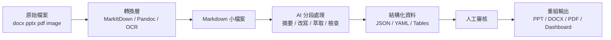
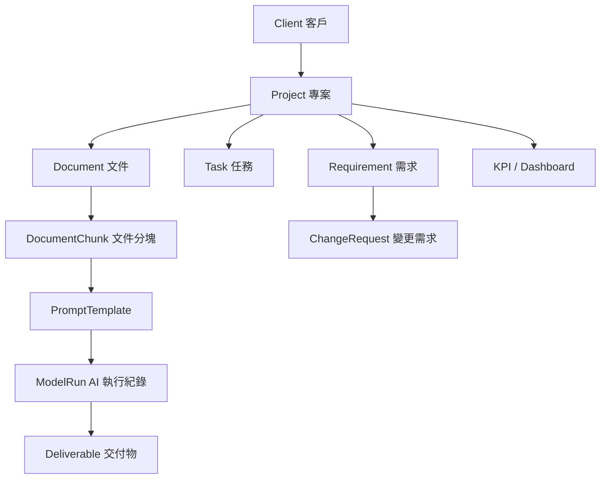

# AI Workflow Workshop 協議內容與課程設計草案

| 原內容 | 思辨 Hook 標題 |
| --- | --- |
| 企業 AI Workflow 基礎觀念 | **為什麼會用 AI，不代表企業真的有 AI Workflow？** |
| AI 友善文件格式與 Markdown / JSON | **為什麼 Word 檔可能是 AI 協作效率最低的格式？** |
| DOCX、PPTX、PDF、圖片前處理 | **AI 真的讀懂你的文件了，還是只是看起來像讀懂？** |
| 文件解構、分段處理、重組文件 | **為什麼未來的文件不是「寫出來」，而是「組裝出來」？** |
| 模型選型與 token 成本控制 | **為什麼最強的模型，常常是最浪費成本的選擇？** |
| Notion 雲端專案管理 | **為什麼專案管理不線上化，AI 導入只會放大混亂？** |
| Obsidian 本地知識庫 | **企業知識到底該放雲端，還是先變成可控的本地大腦？** |
| Context Engineering、RAG、Harness、Agentic Workflow | **Prompt 寫得好就夠了嗎？真正決定 AI 成敗的是 Context** |
| 瑄燁未來 ERP / AI SOP 發展方向 | **下一代 ERP 應該只是記帳系統，還是企業的 AI 操作中樞？** |
| 現場 Q&A 與實務問題討論 | **你現在卡住的問題，是工具問題，還是流程設計問題？** |

## 1. Workshop 定位

本次 Workshop 建議定位為：

> **企業 AI Workflow 基礎建設與文件協同轉型工作坊**
> 
> 
> 以「文件工程、AI 模型選型、雲端協作、知識庫建置、ERP/AI 系統發展方向」為核心，協助瑄燁團隊建立可落地的 AI 工作方法，而不是只學會單點 AI 工具操作。
> 

目標不是教大家「怎麼問 ChatGPT」，而是建立一套企業可複製的 AI 作業邏輯：

```
原始資料 / 檔案
→ 解構為可處理的小型 Markdown / JSON / 純文字資料
→ 使用正確模型與 Prompt 流程處理
→ 人工審核與版本控管
→ 重新組構為 PPT / DOC / ERP / SOP / 知識庫 / 報表
```

---

## 2. 聽眾分析與教學策略

| 聽眾類型 | 人數 | 關注重點 | 教學策略 |
| --- | --- | --- | --- |
| 技術人員 | 3 | 工具鏈、腳本、自動化、資料結構、RAG/LLM 知識庫 | 給具體技術架構與檔案處理流程 |
| 老闆 / 決策者 | 2 | ROI、協作效率、版本管理、ERP 發展方向、組織風險 | 強調管理價值、成本控制、導入路線 |
| 商學院背景人員 | 約 5 | 實務操作、文件產出、專案管理、Notion/Obsidian | 避免過度技術化，用情境與範例說明 |

建議採用「**概念 30% + 示範 40% + 實操 20% + Q&A 10%**」的節奏。此聽眾組成不適合過度深入程式碼，但必須讓技術人員看到未來可延伸的工程路徑。

---

## 3. Workshop 目標

### 3.1 主要教學目標

完成 2 小時後，學員應理解：

1. 為什麼企業 AI Workflow 不應以 `.docx` / 大型 PPT / 圖片式文件作為主要中間格式。
2. 為什麼 Markdown、JSON、CSV、YAML 更適合 AI 處理與版本管理。
3. 如何將大型文件拆成小型 Markdown 檔案，再透過 AI 個別處理與重組。
4. 什麼情境該用高階推理模型、便宜快速模型、Vision 模型、Embedding/RAG。
5. 哪些操作是 token 消耗高手，如何降低成本。
6. 為什麼專案管理必須線上化，Notion 的核心概念與企業協作價值。
7. Obsidian 如何作為本地知識庫，進一步轉為 LLM-WIKI / GitHub-style knowledge repo。
8. Context Engineering、Harness、RAG、Agentic Workflow 的基本概念。
9. 瑄燁未來 ERP / AI SOP 系統應往什麼方向發展。

---

## 4. 與專案附件內容的關聯

附件中的 AI SOP 規格書已定義「AI SOP 流程管理平台」的核心價值，包括標準化 AI 導入流程、提升專案透明度與可控性、降低導入失敗風險、提供數據化決策依據；角色包含 Admin、PM、Engineer、Viewer，功能模組涵蓋專案管理、SOP 流程、Kanban、文件管理、Dashboard、報價與權限管理。這可直接轉化為本次 Workshop 的「組織導入藍圖」。

杰銳計畫文件中也明確指出，目前智慧化程度為 **L2 可視化階段**，已透過 ERP、HMI、電子看板整合訂單、生產與採購資訊，但在標準工時、設備利用率、異常分析及供應鏈透明化數據仍不足，目標是逐步提升至 L3 透明化，再往 L5 自適化智慧工廠發展。這可作為向瑄燁說明「為什麼 AI Workflow 不能只停留在聊天工具，而要進入資料流、知識流、任務流與 ERP 流程」的案例。

補助計畫頁面則顯示，「智慧機械—產業聚落供應鏈數位串流暨 AI 應用」分為先期顧問規劃案與系統建置導入案，提案重點包含供應鏈、智慧機械、人工智慧與資訊安全四大方向。因此本 Workshop 可包裝為「先期 AI 能力建設」與「未來系統建置前的內部教育訓練」。

---

## 5. 2 小時課程架構

### 總時長：120 分鐘

| 時段 | 模組 | 內容 | 形式 |
| --- | --- | --- | --- |
| 0–10 min | 開場與共識建立 | AI Workflow 不是問答工具，而是企業作業系統升級 | 講解 |
| 10–30 min | 文件工程基礎 | 為什麼不建議用 docx / 圖片式文件作為 AI 工作核心 | 講解 + 範例 |
| 30–50 min | Markdown / JSON / 小檔案策略 | 文件解構、分段處理、重組為 PPT/DOC | 示範 |
| 50–70 min | 模型選型與 Token 成本控制 | 何時用高階模型、何時用低成本模型、Vision、RAG | 矩陣講解 |
| 70–85 min | Notion 專案管理線上化 | Database、Page、Relation、Status、Version、責任分工 | 示範 |
| 85–100 min | Obsidian → LLM Knowledge Base | 本地知識庫、Markdown Vault、GitHub repo、LLM-WIKI | 示範 |
| 100–110 min | ERP / AI SOP 發展方向 | 瑄燁未來應發展的 ERP / AI SOP / Dashboard 架構 | 策略建議 |
| 110–120 min | Q&A + 實操診斷 | 學員提問、現場檔案工作流建議 | Q&A |

---

# 6. 核心課程內容展開

## 6.1 模組一：AI Workflow 的正確認知

### 核心觀念

多數企業導入 AI 會失敗，不是因為模型不夠強，而是因為資料與流程仍停留在傳統格式：

```
Email 附件
Word 檔
PPT 檔
圖片截圖
LINE 訊息
人工版本命名
```

這些資料對 AI 來說有幾個問題：

| 問題 | 說明 |
| --- | --- |
| 不易切分 | 大型 docx / pptx 裡面混合文字、表格、圖片、樣式 |
| 不易追蹤版本 | `最終版_v3_真的最終版.docx` 無法有效比對 |
| 不易給 AI 精準處理 | AI 需要乾淨上下文，而不是整包肥大檔案 |
| 不易自動化 | 腳本處理 Markdown / JSON 比處理 docx 容易得多 |
| 容易造成 hallucination | 文件結構不清，AI 容易錯讀標題、表格、圖片關係 |

建議對瑄燁團隊建立一句共識：

> **AI 不是直接吃最終文件，而是處理乾淨、結構化、可切分的中間資料。**
> 

---

## 6.2 模組二：為什麼不建議用 docx 作為 AI 中間格式

### 教學重點

`.docx` 適合作為「交付格式」，不適合作為「AI 工作格式」。

| 格式 | 適合作為輸入 | 適合作為中間編輯 | 適合作為最終交付 | 原因 |
| --- | --- | --- | --- | --- |
| DOCX | △ | ✕ | ◎ | 樣式複雜、版本 diff 困難 |
| PPTX | △ | ✕ | ◎ | 圖文物件分散，AI 難理解頁面意圖 |
| PDF | △ | ✕ | ◎ | 偏展示與封存，不利結構化修改 |
| 圖片 | △ | ✕ | △ | 需 OCR，文字與語義容易失真 |
| Markdown | ◎ | ◎ | △ | 純文字、可拆分、可版本控管 |
| JSON | ◎ | ◎ | △ | 結構化欄位、適合 API 與系統 |
| CSV | ◎ | ◎ | △ | 表格資料、適合分析 |
| YAML | ◎ | ◎ | △ | 適合 metadata、config、frontmatter |

附件中的多格式轉 Markdown 計畫也指出，NotebookLM 不適合作為轉檔工具，較適合「知識問答與摘要」；正確分工應是 **MarkItDown 負責格式轉換 → Obsidian 負責管理編輯 → NotebookLM 負責知識問答**。

---

## 6.3 模組三：企業文件 AI 化的標準流程

建議教學時使用以下流程圖概念：



### 實務示範情境

以一份公司簡報或 SOP 文件為例：

```
input/
  workshop-source.pptx
  sop.docx
  erp-screenshot.png

process/
  01-extract-md/
  02-split-chapters/
  03-ai-cleanup/
  04-review/
  05-export/

output/
  final-workshop.md
  final-report.docx
  final-presentation.pptx
```

### 建議工具

| 任務 | 推薦工具 |
| --- | --- |
| DOCX → Markdown | Pandoc、MarkItDown |
| PPTX → Markdown | MarkItDown、python-pptx |
| PDF → Markdown | MarkItDown、pdfplumber、OCR |
| 圖片 OCR | GPT-4o Vision、Claude Vision、PaddleOCR |
| Markdown 管理 | Obsidian、VS Code |
| 重組為 DOCX/PPTX | Pandoc、Marp、python-pptx |
| 版本管理 | Git / GitHub |
| 知識庫查詢 | NotebookLM、RAG、LLM-WIKI |

---

## 6.4 模組四：模型選型與 Token 成本控制

### 模型選型矩陣

| 情境 | 建議模型類型 | 不建議做法 |
| --- | --- | --- |
| 簡單分類、格式整理、批次命名 | 低成本快速模型 | 用高階推理模型處理大量重複任務 |
| 長文件理解、策略分析、複雜推理 | 高階推理模型 | 把全部文件一次塞入，不分段 |
| 圖片、掃描 PDF、截圖分析 | Vision 模型 + OCR | 將圖片直接貼進每輪對話反覆處理 |
| 大量內部文件問答 | Embedding + RAG | 每次都把整包文件貼給模型 |
| 程式碼、腳本、自動化 | Coding 模型 / 高階推理模型 | 用一般聊天模型要求完整工程落地 |
| 表格資料分析 | Python / SQL + LLM 解釋 | 讓 LLM 純文字猜算表格 |
| 會議記錄整理 | 快速模型先摘要，高階模型再整合 | 原始逐字稿反覆丟進高階模型 |

### Token 消耗高手

以下操作應提醒學員避免：

| 高消耗行為 | 問題 | 改善方式 |
| --- | --- | --- |
| 每次都上傳完整 PPT / DOCX | 重複讀取整份文件 | 先轉 Markdown 並分段 |
| 把圖片當文字來源反覆處理 | Vision token 成本高 | 先 OCR 成文字 |
| 長篇 prompt 重複貼 | 系統上下文浪費 | 建立 reusable prompt template |
| 一次要求 AI 處理 50 頁 | 容易漏讀與幻覺 | 拆章節、拆任務 |
| 用高階模型做格式轉換 | 成本不合理 | 用腳本或低成本模型 |
| 沒有中間檔 | 每次從頭開始 | 保存 md/json 中間結果 |
| 所有人各自問 AI | 知識不沉澱 | 建立共享 Prompt / SOP / Notion DB |

### 建議口訣

```
大文件先拆，小任務先跑；
圖片先 OCR，表格先結構化；
便宜模型做清理，高階模型做判斷；
AI 負責初稿，人負責審核；
中間結果要保存，不要每次重來。
```

---

# 7. Notion 專案管理線上化教學內容

## 7.1 為什麼要用 Notion

Notion 的價值不是「寫筆記」，而是讓專案資訊具備以下能力：

| 傳統作法 | Notion 作法 |
| --- | --- |
| 檔案散落在 Email / LINE / 桌面 | 集中到專案頁面 |
| 任務靠口頭提醒 | 用 Status / Owner / Due Date 管理 |
| 版本靠檔名 | 用頁面歷史與 Database 欄位 |
| 會議記錄找不到 | 每次會議綁定專案與任務 |
| 老闆問進度要人工彙整 | Dashboard 即時呈現 |
| SOP 藏在 Word | SOP 變成可搜尋、可連結、可複用的知識頁 |

### Notion 基礎概念

| 概念 | 說明 | Workshop 應教程度 |
| --- | --- | --- |
| Page | 一個頁面，可放文件、任務、說明 | 必教 |
| Database | 結構化資料表，不只是表格 | 必教 |
| Property | 欄位，例如狀態、負責人、日期 | 必教 |
| Relation | 不同資料庫之間的關聯 | 簡介 |
| Rollup | 從關聯資料彙總資訊 | 簡介 |
| Template | 標準化專案頁 / 會議頁 / 任務頁 | 必教 |
| View | Table、Board、Calendar、Timeline | 必教 |
| Permission | 權限與協作控管 | 必教 |
| Version History | 頁面歷史紀錄 | 簡介 |

---

## 7.2 建議瑄燁 Notion 架構

```
瑄燁 AI Workflow Hub
├── 01_專案總覽 Dashboard
├── 02_客戶 / 案件資料庫
├── 03_AI 導入專案資料庫
├── 04_任務 Kanban
├── 05_會議記錄
├── 06_SOP / Prompt Library
├── 07_文件轉換與資料處理紀錄
├── 08_ERP / 系統需求池
└── 09_知識庫 / FAQ
```

### 最小可行資料庫設計

### Project Database

| 欄位 | 類型 | 說明 |
| --- | --- | --- |
| Project Name | Title | 專案名稱 |
| Client | Relation | 對應客戶 |
| Status | Select | Not Started / Active / Blocked / Done |
| Owner | Person | 負責人 |
| Due Date | Date | 截止日 |
| Phase | Select | Discovery / Data / Build / Deploy / Optimize |
| KPI | Text | 專案目標 |
| Risk | Select | Low / Medium / High |
| Related Docs | Relation | 相關文件 |
| Tasks | Relation | 關聯任務 |

### Task Database

| 欄位 | 類型 | 說明 |
| --- | --- | --- |
| Task | Title | 任務名稱 |
| Project | Relation | 對應專案 |
| Owner | Person | 負責人 |
| Status | Select | Todo / Doing / Review / Done |
| Priority | Select | P0 / P1 / P2 |
| Due Date | Date | 截止日 |
| Output | URL / File | 交付物 |
| Blocker | Text | 卡關原因 |

這可對應 AI SOP 規格書中的「專案管理、SOP 流程、任務管理、文件管理、Dashboard 分析、權限管理」等模組。

---

# 8. Obsidian 作為本地知識庫

## 8.1 Obsidian 的定位

Notion 適合「團隊協作與專案管理」，Obsidian 適合「本地知識庫與長期知識資產」。

| 工具 | 最適用途 |
| --- | --- |
| Notion | 線上專案管理、任務追蹤、團隊協作 |
| Obsidian | 本地 Markdown 知識庫、文件沉澱、個人 / 企業技術庫 |
| GitHub | 版本管理、知識庫發布、技術流程控管 |
| NotebookLM | 對已整理資料做問答與摘要 |
| RAG 系統 | 將知識庫接入企業 AI 系統 |

## 8.2 建議 Obsidian Vault 架構

```
xuan-ai-knowledge/
├── 00-inbox/
├── 01-projects/
│   ├── jray-ai-plan/
│   └── xuan-workshop/
├── 02-sop/
│   ├── file-to-markdown.md
│   ├── prompt-template.md
│   └── ai-review-checklist.md
├── 03-prompts/
├── 04-model-selection/
├── 05-erp-ai-sop/
├── 06-meeting-notes/
├── 07-assets/
└── README.md
```

### 建議每份筆記加入 YAML Frontmatter

```yaml
---
title: AI 文件轉換 SOP
type: sop
status: draft
owner: xuan-team
created: 2026-05-07
tags:
  - ai-workflow
  - markdown
  - document-engineering
---
```

---

## 8.3 LLM-WIKI / GitHub 倉庫概念

可向學員說明：

> **LLM-WIKI 是把企業知識庫整理成 LLM 友善的 GitHub repository。**
> 

它不是單純「把檔案丟給 AI」，而是將知識整理成：

```
README.md                # 知識庫入口
docs/
  ai-workflow.md
  erp-system-design.md
  file-conversion.md
sop/
  document-processing.md
  meeting-summary.md
prompts/
  extract-requirements.md
  summarize-project.md
data-schema/
  project.schema.json
  task.schema.json
```

這樣做的優勢：

| 優勢 | 說明 |
| --- | --- |
| 可版本控管 | 每次修改都可追蹤 |
| 可被 LLM 讀取 | Markdown 結構清楚 |
| 可建立 RAG | 方便 embedding 與 chunking |
| 可成為內部 SOP | 新人可直接閱讀 |
| 可自動化生成文件 | 從 md/json 產出 docx/pptx |

---

# 9. Context Engineering / Harness / RAG / Agentic AI 基礎概念

## 9.1 Context Engineering

**Context Engineering（上下文工程）** 是設計 AI 在任務中「該看到什麼、看多少、以什麼順序看、用什麼格式看」的工程方法。

它比 Prompt Engineering 更重要，因為企業 AI 的問題通常不是 prompt 寫不好，而是上下文混亂。

### 對學員的簡化說法

```
Prompt Engineering：怎麼問 AI
Context Engineering：餵 AI 什麼資料、用什麼結構餵、何時餵、餵多少
```

### 實例

錯誤方式：

```
幫我看這整份 80 頁計畫書，整理重點。
```

正確方式：

```
1. 先將計畫書依章節切成 Markdown
2. 每章摘要為固定 JSON
3. 彙整所有 JSON
4. 再產生總結與簡報
```

---

## 9.2 RAG

**RAG（Retrieval-Augmented Generation，檢索增強生成）** 是讓 AI 回答前先去知識庫搜尋相關資料，再根據搜尋結果回答。

適用情境：

| 適合 RAG | 不適合 RAG |
| --- | --- |
| 公司 SOP 問答 | 需要即時大量計算 |
| 內部文件查詢 | 完全沒有文件來源的創意發想 |
| ERP 欄位說明 | 高度機密且未建權限控管 |
| 補助計畫 FAQ | 圖像生成 |
| 技術知識庫 | 單次短文改寫 |

---

## 9.3 Harness

此處建議將 Harness 解釋為：

> **Harness 是一套可重複執行、可測試、可控管的 AI 工作流外殼。**
> 

不是每次手動開 ChatGPT，而是把任務變成可重跑流程：

```
input files
→ parser
→ prompt template
→ model call
→ validator
→ human review
→ export
```

### 範例

```
合約審查 Harness
1. 接收 PDF / DOCX
2. 轉 Markdown
3. 抽取條款 JSON
4. 檢查風險條款
5. 產生審查報告
6. 人工確認
```

---

## 9.4 Agentic Workflow

可簡化為：

> **Agentic Workflow 是讓 AI 不只回答，而是能拆任務、調工具、檢查結果、循環修正。**
> 

但在企業導入初期不建議過度追求 Agent。應先做好：

```
資料格式 → 文件流程 → 權限管理 → 任務追蹤 → 知識庫 → 再導入 Agent
```

---

# 10. 瑄燁未來 ERP / AI SOP 系統建議

## 10.1 發展方向

依附件規格，AI SOP 系統應從「管理 AI 導入流程」逐步擴展為「企業 AI Workflow Operating System」。目前規格書已有專案、SOP、任務、文件、Dashboard、報價、權限等模組，建議未來再補強以下方向：

| 模組 | 建議發展 |
| --- | --- |
| 專案管理 | 每案建立標準 Phase、WBS、交付物、查核點 |
| 文件管理 | 所有 docx/ppt/pdf 先轉 Markdown 中間層 |
| Prompt Library | 建立可版本控管的 Prompt 與模型設定 |
| AI Run Log | 記錄每次模型、token、輸入、輸出、成本 |
| Data Room | 客戶資料、API、DB、文件統一盤點 |
| Requirement Hub | 需求訪談、可行性分析、變更需求管理 |
| SOP Template | 將成功案例轉成公版 SOP |
| Dashboard | 顯示進度、成本、風險、卡關、KPI |
| RAG Knowledge Base | 將文件與 SOP 轉成可查詢知識庫 |
| Permission / Audit | 權限、版本、審計紀錄、資安控管 |

---

## 10.2 ERP / AI SOP 的資料物件設計

建議未來系統至少有以下資料表或資料物件：

```
Client
Project
Task
Document
DocumentChunk
PromptTemplate
ModelRun
Requirement
ChangeRequest
MeetingNote
Deliverable
Risk
KPI
User
Role
Permission
```

### 關鍵資料流



---

## 10.3 對瑄燁最重要的 ERP 能力

### 1. 需求與變更控管

附件中的 SOP 文件提到「如果已經定義完成的內容變更流程為何」、「已完成計畫書內容如何轉換成標準內容以利下次提案快速使用」、「公版內容如何存放與管理」等待討論事項。這正是 ERP / AI SOP 系統應優先處理的核心。

建議建立：

```
需求初探
→ 需求確認
→ 報價簽署
→ 合約簽署
→ 執行
→ 變更需求申請
→ 雙方確認時程與費用
→ 重新排程
```

### 2. 文件公版化

所有完成的計畫書、報價單、合約條款、會議記錄，應逐步沉澱為：

```
template/
  proposal-template.md
  quotation-template.md
  contract-clause-template.md
  ai-sop-template.md
```

### 3. 成本與模型使用紀錄

每次 AI 執行應記錄：

| 欄位 | 說明 |
| --- | --- |
| Project | 專案 |
| Task | 任務 |
| Model | 使用模型 |
| Input Tokens | 輸入 token |
| Output Tokens | 輸出 token |
| Cost | 成本估算 |
| Prompt Version | 使用哪版 Prompt |
| Output File | 輸出檔案 |
| Reviewer | 審核人 |
| Status | 通過 / 需修改 |

---

# 11. Workshop 現場實操設計

## 實操一：把 Word / PPT 思維轉成 Markdown 思維

### 題目

請學員把以下傳統文件目錄轉為 Markdown 結構：

```
計畫書.docx
簡報.pptx
會議紀錄.docx
ERP截圖.png
報價單.xlsx
```

### 目標輸出

```
project-folder/
├── README.md
├── 01-background.md
├── 02-requirements.md
├── 03-system-design.md
├── 04-budget.md
├── 05-meeting-notes.md
├── assets/
└── exports/
```

---

## 實操二：模型選型判斷

給學員 6 個任務，讓他們選模型：

| 任務 | 建議答案 |
| --- | --- |
| 整理 30 份會議記錄成摘要 | 低成本模型 + 分批 |
| 判斷 ERP 發展策略 | 高階推理模型 |
| OCR 掃描 PDF | OCR / Vision |
| 查詢 SOP 條文 | RAG |
| 批次改檔名 | 腳本，不用 LLM |
| 產出董事會簡報初稿 | 高階模型 + Markdown 中間稿 |

---

## 實操三：Notion 專案頁設計

讓學員建立一個最小專案頁：

```
專案名稱：AI 文件轉換 SOP 建置
目標：將公司常用文件轉為 Markdown 管理
負責人：A
截止日：YYYY/MM/DD
任務：
- 盤點檔案格式
- 建立轉檔流程
- 建立 Prompt Template
- 建立審核規則
- 匯出最終文件
```

---

# 12. 協議書可用工作範疇文字

以下可直接放進 Workshop 協議或報價單。

## 12.1 服務名稱

**企業 AI Workflow 基礎建設與文件協同轉型 Workshop**

## 12.2 服務內容

乙方提供 2 小時 AI Workflow 教學演講與實務工作坊，內容包含：

1. 企業 AI Workflow 基礎觀念說明。
2. AI 友善文件格式與 Markdown / JSON 中間層說明。
3. DOCX、PPTX、PDF、圖片等常見檔案之 AI 前處理策略。
4. 文件解構、分段處理、AI 編輯、重新組構為 DOCX / PPTX 之流程說明。
5. AI 模型選型基礎與 token 成本控制方法。
6. Notion 作為雲端專案管理與協作平台之基礎架構介紹。
7. Obsidian 作為本地知識庫與 LLM 知識庫前置整理方式之介紹。
8. Context Engineering、RAG、Harness、Agentic Workflow 等基礎概念說明。
9. 針對瑄燁未來 ERP / AI SOP 系統發展方向提供初步建議。
10. 現場 Q&A 與學員實務問題討論。

## 12.3 交付項目

建議協議中明確列出：

| 交付項目 | 說明 |
| --- | --- |
| Workshop 教學 1 場 | 2 小時，含講解、示範、Q&A |
| 課程大綱 | Markdown / PDF 版本 |
| AI Workflow Cheat Sheet | 模型選型、token 控制、文件處理重點 |
| Notion 架構建議 | 基礎資料庫與專案管理架構 |
| Obsidian / LLM-WIKI 架構建議 | 本地知識庫資料夾規劃 |
| ERP / AI SOP 初步建議 | 依附件與現況提出模組建議 |
| Q&A 整理 | 會後依現場問題整理重點，若合約包含 |

## 12.4 不包含項目

建議明確排除：

```
本服務不包含：
1. 客製化 ERP 系統開發。
2. Notion workspace 完整建置。
3. Obsidian Vault 完整搬遷與整理。
4. 大量歷史文件轉檔。
5. API 串接、RAG 系統開發或私有模型部署。
6. 企業資安稽核或正式資安顧問服務。
7. 會後長期顧問諮詢，除非雙方另行約定。
```

---

# 13. 建議簡報頁面大綱

若後續要製作簡報，可用以下 16 頁：

1. Workshop Title：企業 AI Workflow 基礎建設
2. 為什麼多數企業 AI 導入會卡住
3. AI 不缺答案，缺的是乾淨資料流
4. DOCX / PPTX / PDF / 圖片作為 AI 工作格式的限制
5. Markdown / JSON / CSV 為什麼更適合 AI
6. 文件解構 → AI 處理 → 文件重組流程
7. 常見工具：MarkItDown / Pandoc / OCR / Obsidian / Notion
8. 模型選型矩陣
9. Token 消耗高手與省錢策略
10. Notion：從文件夾變成專案作業系統
11. Notion Database 基礎概念
12. Obsidian：本地 Markdown 知識庫
13. LLM-WIKI / GitHub-style knowledge repo
14. Context Engineering / RAG / Harness / Agentic Workflow
15. 瑄燁未來 ERP / AI SOP 發展方向
16. 實操任務與 Q&A

---

# 14. 最終建議結論

本 Workshop 應避免被定位成「AI 工具教學課」，而應定位成：

> **瑄燁未來 ERP、AI SOP、知識庫與文件自動化的前置能力建設。**
> 

最重要的三個落地結論：

1. **文件格式先轉型**
    
    DOCX / PPTX / PDF 應作為交付格式，不應作為 AI 中間處理核心。中間層建議採 Markdown / JSON / YAML。
    
2. **協作流程先線上化**
    
    Notion 應作為專案、任務、會議、文件狀態的協同中心，避免資訊分散於 Email、LINE、個人電腦。
    
3. **知識庫先結構化，再談 Agent / ERP / RAG**
    
    Obsidian / GitHub-style LLM-WIKI 可作為本地知識資產基礎，未來再接 RAG、AI SOP 系統與 ERP 模組。
    

---

## 

[Workshop 簡報生成提示詞｜企業 AI Workflow（演講稿 + 視覺呈現規格）](https://www.notion.so/Workshop-AI-Workflow-8b957fce715840bf9712ba5657625d91?pvs=21)

[](https://www.notion.so/35fe65b8b2e680f6979dc15061f8f641?pvs=21)